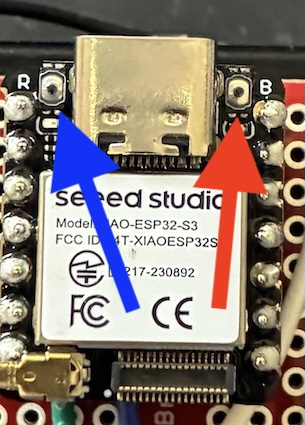

# Keepkey communication bridge project

This project allows a keepkey to be a standalone device (no USB cable) that communicates with the host via bluetooth LE or optical (WIP). Developed and tested on an esp32s3 module that can act as a USB host for the kk.

BLE communication requires the host to transport data via bluetooth. Because BLE throughput is much slower than USB, some operations may be noticeably slower (like pushbutton confirmations) and thus there may be client timeouts that need adjustment.

# Requirements

1. 9 volt battery.

2. USB micro male to USB C male adapter. This is currently a specialized adapter but can be found and ordered online.

# Hardware setup

1. Need to supply 5V to 5V pin on esp32s3 board, necessary for USB host (already in place on prototype devices).

# Build firmware

1. Open a command line terminal
2. Set up the espressif IDE for your system as described here: https://docs.espressif.com/projects/esp-idf/en/latest/esp32/get-started/
3. Clone repo:  $ git clone https://github.com/markrypt0/kkcom_bridge
4. Build from root directory ./kkcom_bridge: $ idf.py build

# Update firmware on device

1. Turn device power off and leave battery powered down, power will be supplied via the USB bus.
2. Hold boot button down while plugging device into build machine. If successful, on a linux system you should now have a device file /dev/ttyACM0.
3. Flash firmware from root directory: idf.py -p /dev/ttyACM0 flash

# Operation

1. Green LED indicates a kk has been detected and claimed on USB bus. Blue LED indicates bluetooth communication. There is a red power LED on the esp32s3 board.

2. There are two tiny buttons on the esp32s3 board on either side of the usb plug. They are "reset" and "boot". They are marked R and B respectively. In the photo below, the blue arrow points to the reset button and the red arrow points to the boot button. You'll probably need something like a toothpick to press the buttons but they make a distinct click when depressed.

The reset button resets the kkcom bridge and works to put the bridge in an initialized state with the kk claimed.

The boot button is for firmware updates, see "Build firmware and flash" above for operation of the boot button.

3. Turn on device. On any ble scanner app, you should see a device named "kkcomm-server"

4. Plug in a keepkey, green LED should turn on when keepkey is ready.

# Caveats

1. Bluetooth LE transport is slower than USB. Many Keepkey messages and operations are short messages and so the delay will not be significant. However, it is likely that you will notice a delay in operations, namely the time it takes for the confirmation button to start working.

2. Long transfers will take significantly more time. Firmware updates should not be done using the bluetooth transport.

3. debuglink is not implemented at this time, i.e., auto_button does not work.

4. kkcom bridge currently does not report whether a kk is connected. System assumes a kk is connected and claimed on usb bus.